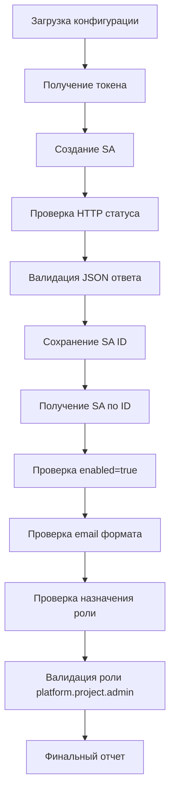

# План создания сервисного аккаунта и автотестов в cloud.ru

## Задача
Создать сервисный аккаунт для работы с Kubernetes кластером в cloud.ru через API и написать автотесты для подтверждения результата.

## Текущее состояние
- Уже есть токен доступа в `opsx/cloud-ru-token.txt`
- Конфигурация в `auth--cloud-ru--for-api/config--env.sh` содержит KEY_ID, SECRET и PROJECT_ID
- Существуют bash-скрипты для создания/удаления SA: `create-sa--script.sh`, `delete-sa--script.sh`
- В проекте используется спецификация spec-driven (см. `opsx/config.yaml`)

## Шаги выполнения

### 1. Создать структуру автотестов
- Создать каталог `tests/service-account/`
- Создать файл `tests/service-account/01-create-sa-test.sh` - тест создания сервисного аккаунта
- Создать файл `tests/service-account/02-get-sa-test.sh` - тест получения информации о SA
- Создать файл `tests/service-account/03-check-role-test.sh` - тест проверки назначения роли
- Создать файл `tests/service-account/utils.sh` - общие функции для тестов

### 2. Реализовать автотесты

#### 01-create-sa-test.sh
- Использовать существующий `get-token--script.sh` для получения токена
- Выполнить POST запрос на `https://iam.api.cloud.ru/api/v1/service-accounts`
- Проверить HTTP-статус (200 или 201)
- Проверить структуру ответа JSON (обязательные поля: id, name, email)
- Сохранить ID созданного SA в переменную/файл для последующих тестов

#### 02-get-sa-test.sh
- Использовать ID из предыдущего теста
- Выполнить GET запрос на `https://iam.api.cloud.ru/api/v1/service-accounts/<id>`
- Проверить HTTP-статус (200)
- Проверить, что SA активен (enabled: true)
- Проверить email SA (формат: `<name>@<projectId>.iam.cloud.ru`)

#### 03-check-role-test.sh
- Выполнить GET запрос на `https://iam.api.cloud.ru/api/v1/permissions?subjectId=<sa-id>&subjectType=service_account`
- Проверить, что роль `platform.project.admin` назначена
- Проверить, что objectId соответствует projectID

### 3. Создать спецификацию API
- Создать файл `specs/service-account-api.json` с OpenAPI спецификацией
- Описать эндпоинты:
  - POST /api/v1/service-accounts
  - GET /api/v1/service-accounts/{id}
  - GET /api/v1/permissions
- Описать модели ответов с валидацией полей

### 4. Создать документацию
- Обновить `docs/cloud-ru/Создать сервисный аккаунт в cloud.ru.md` ссылками на автотесты
- Создать `tests/service-account/README.md` с инструкциями по запуску

## Ожидаемые результаты
- Сервисный аккаунт создан и активен
- Назначена роль `platform.project.admin`
- Автотесты проходят успешно и подтверждают результат
- Спецификация API создана и соответствует реализации
- Документация обновлена

## Архитектура тестов



## Инструкция по запуску

```bash
# Загрузить переменные окружения
source auth--cloud-ru--for-api/config--env.sh

# Запустить все тесты
cd tests/service-account
chmod +x *.sh
./run-all-tests.sh

# Запустить конкретный тест
./01-create-sa-test.sh
./02-get-sa-test.sh
./03-check-role-test.sh
```

## Критерии успеха
1. Все автотесты проходят успешно
2. HTTP-статусы соответствуют спецификации API
3. JSON-структура ответов валидна
4. Сервисный аккаунт создан с корректными параметрами
5. Роль назначена корректно
6. Документация обновлена