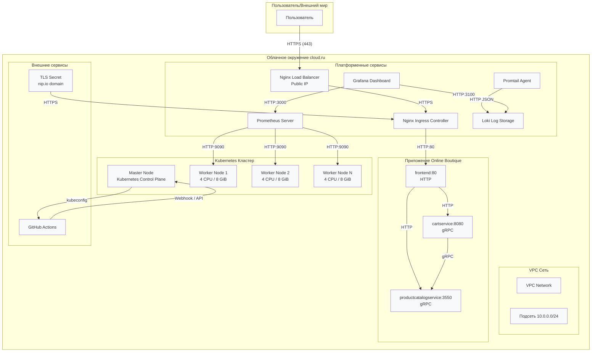

# AI-First Kubernetes Project (ai-first--k8s--otus)

## Обзор проекта

Это учебный проект демонстрирует развертывание управляемого кластера Kubernetes в облаке cloud.ru с применением подхода AI-first. Проект реализует полное решение "Infrastructure as Code" для запуска приложения Online Boutique (микросервисное приложение).

## Архитектура

### Диаграмма архитектуры



### Инфраструктура

#### VPC Сеть
- **VPC Network**: Виртуальная частная сеть cloud.ru
- **Подсеть**: 10.0.0.0/24 для кластера Kubernetes
- **Security Groups**: Группы безопасности для контроля трафика
- **Public IP**: Выделенный публичный IP для Load Balancer

#### Kubernetes Кластер
- **Master Node**: Управляемый контрольный план Kubernetes (версия 1.28)
  - API Server
  - etcd (распределенная база данных)
  - Scheduler
  - Controller Manager
- **Worker Nodes**: Группа из 2-3 нод (настраиваемое количество)
  - **Ресурсы**: 4 vCPU / 8 GiB RAM на ноду
  - **Операционная система**: Ubuntu 22.04 LTS
  - **Контейнерный рантайм**: containerd

#### Сетевая инфраструктура
- **Load Balancer**: Внешний балансировщик для Nginx Ingress Controller
- **Internal Load Balancer**: Для сервисов внутри кластера
- **DNS**: nip.io для динамического DNS (frontend.<CLUSTER_IP>.nip.io)

### Платформенные сервисы

#### Nginx Ingress Controller
- **Роль**: Входная точка для внешнего HTTP/HTTPS трафика
- **Конфигурация**: 
  - Тип сервиса: LoadBalancer
  - HTTPS с самоподписанным сертификатом
  -规则: routing по host и path
- **Путь трафика**: 
  ```
  User → NLB (Public IP:443) → Ingress Controller (HTTPS) → Frontend Service (HTTP:80)
  ```

#### Мониторинг (Prometheus + Grafana)
- **Prometheus**:
  - Сбор метрик с кластера и приложений (каждые 30 секунд)
  - Хранение временных рядов (15 дней по умолчанию)
  - ServiceMonitor для автоматического обнаружения сервисов
- **Grafana**:
  - Дашборды: Kubernetes Cluster, Application Metrics
  - Alertmanager для уведомлений
  - Порт: 3000 (LoadBalancer или NodePort)
- **Путь сбора данных**:
  ```
  Worker Nodes → kubelet (metrics) → Prometheus
  Application Pods → /metrics endpoint → Prometheus (via ServiceMonitor)
  ```

#### Логирование (Loki + Promtail)
- **Promtail**:
  - Агент сбора логов, запущенный как DaemonSet
  - Сбор логов со всех контейнеров в кластере
  - Отправка в Loki по HTTP JSON
- **Loki**:
  - Централизованное хранилище логов
  - Индексация для быстрого поиска
  - Хранение: 10Gi PVC (настраиваемо)
- **Путь сбора логов**:
  ```
  Container Logs → Promtail → Loki → Grafana Explore (visualization)
  ```

#### Alertmanager (часть Prometheus)
- **Правила алертинга**:
  - FrontendPodDown: Падение pod frontend
  - HighCPUUsage: Использование CPU > 80%
  - HighMemoryUsage: Использование памяти > 85%
- **Интеграции**: Email, Slack (настраиваемо)

### Приложение Online Boutique

#### Компоненты
1. **Frontend** (`frontend:80`)
   - Веб-интерфейс интернет-магазина
   - HTTP API для взаимодействия с другими сервисами
   - Метрики: `/metrics` endpoint для Prometheus

2. **Cart Service** (`cartservice:8080`)
   - Управление корзиной покупок
   - gRPC API для взаимодействия
   - Кэширование в Redis (опционально)

3. **Product Catalog Service** (`productcatalogservice:3550`)
   - Каталог продуктов
   - gRPC API для поиска и получения информации о товарах
   - Метрики: `/metrics` endpoint

#### Схема взаимодействия
```
Пользователь → Frontend (HTTP)
Frontend → CartService (HTTP)
Frontend → ProductCatalogService (HTTP)
CartService → ProductCatalogService (gRPC)
```

#### Deployment стратегия
- **Kustomize**: Базовые манифесты + патчи для окружения
- **GitHub Actions**: Автоматический деплой при изменении кода
- **Rolling Update**: Без простоев при обновлении

### CI/CD Инфраструктура

#### GitHub Actions
- **Триггеры**: 
  - Push в ветку `develop`
  - Ручной запуск (workflow_dispatch)
- **Этапы**:
  1. Checkout репозитория
  2. Настройка kubeconfig (из секретов GitHub)
  3. Применение манифестов через Kustomize
  4. Ожидание готовности pod'ов (kubectl wait)
- **Безопасность**: 
  - Секреты: KUBECONFIG, API ключи
  - RBAC: Минимальные права для сервисного аккаунта

## Технологический стек

| Категория | Технология | Версия/Источник |
|----------|------------|----------------|
| Infrastructure as Code | Terraform | >=1.5 |
| Оркестрация контейнеров | Kubernetes | 1.28 |
| Менеджер пакетов | Helm | >=3.12 |
| CI/CD | GitHub Actions | latest |
| Мониторинг | Prometheus | latest |
| Метрики | Grafana | latest |
| Логирование | Loki | latest |
| Агент логов | Promtail | latest |
| Ingress | Nginx Ingress Controller | latest |
| Облачный провайдер | cloud.ru | API v1 |
| Язык манифестов | YAML | - |
| Сериализация данных | JSON, gRPC | - |

## Структура каталогов

```
.
├── authentication--cloud-ru--for-api/  # Скрипты аутентификации для cloud.ru API
│   ├── config--env.sh                  # Конфигурация окружения
│   ├── create-sa--script.sh            # Создание сервисного аккаунта
│   ├── delete-sa--script.sh            # Удаление сервисного аккаунта
│   ├── get-token--script.sh            # Получение токена
│   └── menu--script.sh                 # Главное меню скрипта
├── opsx/                               # Конфигурация проекта
│   ├── config.yaml                     # Настройки проекта
│   └── specs/                          # Спецификации
├── docs/                               # Документация (этот каталог)
│   └── README.md                       # Этот файл
├── terraform/                          # Конфигурации Terraform
│   ├── main.tf                         # Основной Terraform код
│   ├── variables.tf                    # Определение переменных
│   ├── outputs.tf                      # Определение выводов
│   └── terraform.tfvars                # Значения переменных
├── kubernetes/                         # Kubernetes манифесты
│   ├── ingress/                        # Конфигурации Ingress
│   │   ├── nginx-values.yaml           # Настройки nginx-ingress-controller
│   │   ├── tls-secret.yaml             # Самоподписанный сертификат
│   │   └── ingress.yaml                # Правило Ingress для приложения
│   ├── monitoring/                     # Конфигурации мониторинга
│   │   ├── prometheus-values.yaml      # Настройки kube-prometheus-stack
│   │   ├── servicemonitor.yaml         # ServiceMonitor для приложения
│   │   └── alerts.yaml                 # Дополнительные правила алертов
│   ├── logging/                        # Конфигурации логирования
│   │   └── loki-values.yaml            # Настройки loki-stack
│   └── application/                    # Развертывания приложения
│       ├── kustomization.yaml          # Kustomize конфигурация
│       ├── deployment-frontend.yaml    # Deployment frontend
│       ├── service-frontend.yaml       # Service frontend
│       ├── deployment-cartservice.yaml # Deployment cartservice
│       ├── service-cartservice.yaml    # Service cartservice
│       ├── deployment-productcatalogservice.yaml
│       └── service-productcatalogservice.yaml
└── .github/workflows/                  # CI/CD пайплайны
    └── deploy-app.yml                  # Пайплайн развертывания
```

## Подход к развертыванию

1. **Настройка инфраструктуры**: Terraform создает кластер Kubernetes и сетевую инфраструктуру в cloud.ru
2. **Платформенные сервисы**: Helm развертывает сервисы мониторинга, логирования и ingress контроллеры
3. **Развертывание приложения**: CI/CD пайплайн (GitHub Actions) развертывает компоненты приложения
4. **Доступ**: Публичный HTTPS доступ через Ingress с доменом nip.io

## CI/CD пайплайн

Проект использует GitHub Actions для автоматического развертывания:
- **Триггер**: Пуш в ветку develop или ручной запуск workflow
- **Шаги**:
  1. Клонирование репозитория
  2. Настройка kubectl с помощью kubeconfig
  3. Развертывание приложения с использованием Kustomize
  4. Ожидание готовности pod'ов
- **Безопасность**: Секреты хранятся в GitHub Secrets, kubeconfig зашифрован

## Мониторинг и логирование

### Мониторинг (Prometheus + Grafana)
- Сбор метрик кластера и приложения
- Предустановленные дашборды для мониторинга Kubernetes и приложения
- Правила алертинга для критических условий (например, падение pod frontend)
- **Ключевые метрики**: CPU/Memory usage, pod status, request latency, error rate

### Логирование (Loki + Promtail)
- Централизованный сбор логов со всех pod'ов
- Запросы к логам через Grafana Explore
- Возможности структурированного анализа логов
- **Формат логов**: JSON с метаданными Kubernetes (namespace, pod name, container name)

## Быстрый старт

### Предварительные требования
- Учетная запись cloud.ru с доступом к API
- Terraform (>=1.5)
- kubectl
- Helm (>=3)
- GitHub репозиторий с настроенными секретами

### Основные шаги
1. Склонировать репозиторий
2. Настроить переменные Terraform
3. Развернуть инфраструктуру: `terraform validate` → `terraform apply`
4. Получить kubeconfig: `terraform output kubeconfig > ~/.kube/config`
5. Развернуть платформенные сервисы через Helm (ingress, monitoring, logging)
6. Настроить секреты CI/CD и запустить развертывание

## Лицензия

Этот проект предоставляется в образовательных целях как часть курса OTUS по Kubernetes.
